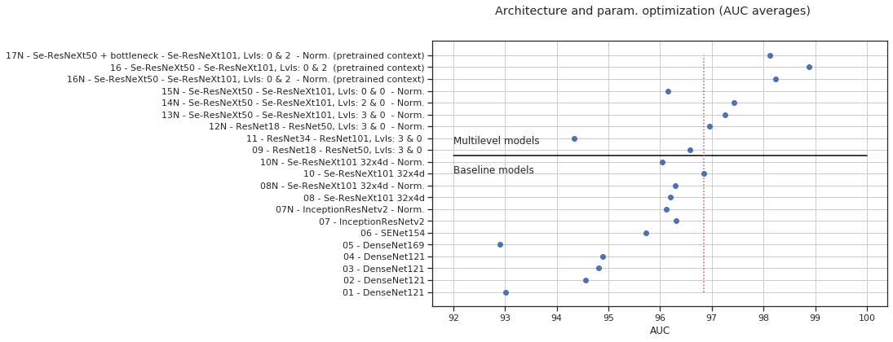

# Camelyon17 - Multilevel feature fusion in digital pathology

Deep learning algorithms have proven to be efficient and accurate when detecting
metastases in hematoxylin and eosin-stained tissue, and their performance is comparable to
the level of an expert pathologist. Many of the tumor-detecting deep learning algorithms
focus on the local features that are in the small batches of images, which leaves out
potentially relevant features from the surroundings.[1] For example, the eosinophils are
characteristic in some parts of a tissue sample, whereas some parts can indicate a tumor or other
disease. Small image batches may not contain enough spatial information for this.

## Research questions
1. Does including information from the surrounding area, improve the performance of
deep learning tumor detection algorithm?
2. What features will a deep neural network focus on with different scales, when it is
trained to detect a tumor?

## Hypothesis
A deep neural network will learn to use information from a wider receptive field and this
improves the detection performance. High zoom level parts of the network will focus on the
detailed structures while the low zoom levels will focus more on regional structures.

## Methodology
1. Build one or more convolutional neural network (CNN) architectures that use
information from different zoom levels. Design one, otherwise similar architecture for
comparison that uses only data from the highest zoom level (baseline).
2. Split Cameleon17 training data set to training and test parts (split by centers).
3. Sample Camelyon17 training and validation set. Sample evenly from tumor and
normal areas. Sample only from the tissue areas (Otsu or another thresholding
method).
4. Sample Cameleon17 test set covering all tissue parts. Overlapping sampling.
5. Train models and measure the center-fold cross-validation performance. Binary
classification metric: ROC AUC. Optimize architectures and training
hyper-parameters.
6. Predict probability heatmaps for the test set and threshold for tumor detection.
Measure mean IOU (area of overlap/area of a union) and compare to literature.
7. Analyze the models by visualizing the gradient class activation mappings (Grad-CAM) 
from the different zoom levels [2].
8. Transfer models to different cancer if annotated data is available, and measure the
performance. (not included here)

----------------------------------------

# Project

This section describes the project structure, software dependencies, and notebook contents.

### Environment used
- 64bit Ubuntu 16.04.6 LTS (Xenial Xerus) GNU/Linux (virtual)
- 2x Intel Xeon Platinum 8160 CPU @ 2.10GHz
- 4x Nvidia Tesla V100, 32GB
- 1510GB RAM
- 6.4T NVMe SSD

### Software used
- [PyTorch](https://pytorch.org/docs/stable/index.html) 1.1.0
- TorchVision 0.3.0
- [Fastai](https://docs.fast.ai/) 1.0.52
- [OpenSlide](https://openslide.org/download/) 3.4.1 (ASAP 1.8 depends on libopenslide)
- [ASAP](https://github.com/computationalpathologygroup/ASAP) 1.8 (1.9 does not support the Philips scanner TIFF file format of the `Center_4`)
- [OpenCV](https://opencv.org/) 4.1.0

## Project structure
This project assumes that the [Camelyon17 training data set](https://camelyon17.grand-challenge.org/Data/) is downloaded and unzipped in the following way:

```
data/
    |_annotations/
        |_patient_004_node.xml
        |_...
    |_training/
        |_center_0
            |_patient_000.tif
            |_...
        |_...
    |_stage_labels.csv
```

## Notebooks
These should be run in order as the preprocessing steps are prerequisites for the later notebooks.

1. **Preprocessing** - Convert lesion annotations to masks
  - Camelyon17 annotations are stored in polygon representations (xml). This notebook converts them to tif pixel image masks where value of 1 means tumor and 2 means normal.
2. **Preprocessing** - View tumor annotations and create tissue masks
  - 16 times downsampled tissuemasks are stored as binary (0-background, 255-tissue) uint8 numpy arrays from each WSI.
3. **Preprocessing** - Create dataframes
  - Dataframe contains center coordinates, tissue percentage, tumor percentage, file information, and label of all the tissue samples.
4. **Statistics** - Patch stats
5. **Dataset** - Sampling splits
6. **Dataset** - Creating patches
7. **Normalization** - Normalize H&E staining in patches to compare models with, and without normalization.
8. **Baseline** - Baseline models - hyperparameter optimization
9. **Multilevel** - Multilevel models - hyperparameter optimization
10. **Pretraining modules** - Pretraining multilevel CNN modules
11. **Pretrained multilevel** - Multilevel models with autoencoder pretrained context encoders
12. **Test** - Test set performance
13. **Conclusion** - Overview and analysis of the results

## Hyperparam opt. and testing results
The scores are from 4 CV folds (leave one center out cross-validation). Model folds are trained on 3 and tested on one of the train centers (0-3).

- **Fold_0**: Train={`center_1`,`center_2`,`center_3`}, Validation={`center_0`}
- **Fold_1**: Train={`center_0`,`center_2`,`center_3`}, Validation={`center_1`}
- **Fold_2**: Train={`center_0`,`center_1`,`center_3`}, Validation={`center_2`}
- **Fold_3**: Train={`center_0`,`center_1`,`center_2`}, Validation={`center_3`}

- id suffix `N` = Trained and tested on normalized data
- id suffix `A` = Trained on heavily color augmented data

**Baseline models**

|id  |Model           |Normalized |Epochs, LR (head/finetune)   |Fold_0 AUC| Fold_1 AUC| Fold_2 AUC| Fold_3 AUC | AVG AUC |
|:--:|:--------------:|:---------:|:---------------------:|:----------:|:-----------:|:-----------:|:------------:|:---------:|
|01	 |DenseNet121	  |False      |10/10 epochs, 3e-3/1e-5| 93.385   | 86.131      | 94.808      | 97.759       | 93.021    |
|02	 |DenseNet121	  |False      |8/4 epochs, 3e-3/1e-5  | 94.985   | 90.696      | 94.222      | 98.337       | 94.560    |
|03	 |DenseNet121	  |False      |4/2 epochs, 3e-3/5e-6  | 90.441   | 93.447      | **97.445**      | 97.940       | 94.818    |
|04	 |DenseNet121	  |False      |4/2 epochs, 3e-3/5e-6  | 94.514   | 95.185      | 93.049      | 96.799       | 94.886    |
|05	 |DenseNet169	  |False      |4/2 epochs, 3e-3/5e-6  | 87.867   | 93.630      | 92.140      | 97.965       | 92.901    |
|06	 |SENet154	      |False      |4/2 epochs, 3e-3/5e-6  | 93.994   | 95.950      | 94.339      | **98.651**       | 95.734    |
|07	 |InceptionResNetv2|False     |4/2 epochs, 3e-3/5e-6  | 94.609   | 96.160      | 96.321      | 98.129       | 96.305    |
|07N |InceptionResNetv2|True      |4/2 epochs, 3e-3/5e-6  | 96.156   | 96.822      | 94.862      | 96.670       | 96.128    |
|08	 |Se-ResNeXt101 32x4d|False   |4/2 epochs, 3e-3/5e-6  | 93.926   | 95.834      | 96.660      | 98.370       | 96.198    |
|08N |Se-ResNeXt101 32x4d|True    |4/2 epochs, 3e-3/5e-6  | 96.578   | 97.092      | 94.190      | 97.351       | 96.302    |
|**10**	 |Se-ResNeXt101 32x4d|False   |1/- epoch, 1e-3/-      | 97.011   | 96.710      | 95.991      | 97.696       | 96.852    |
|10N |Se-ResNeXt101 32x4d|True    |1/- epoch, 1e-3/-      | 98.227   | 94.772      | 95.201      | 95.978       | 96.045    |
|18A |Se-ResNeXt101 32x4d|False    |1/- epoch, 1e-3/-      | **98.822**   | **97.993**  | 96.143      | 96.468       | **97.356**    |

**Multilevel models**

|id |Model (context)|Model (focus)|Normalized|Epochs, LR (head)|Levels|Fold_0 AUC|Fold_1 AUC|Fold_2 AUC|Fold_3 AUC|AVG AUC|
|:-:|:-------------:|:-----------:|:--------:|:---------------:|:----:|:--------:|:--------:|:--------:|:--------:|:-----:|
|09	|ResNet18	    |ResNet50	  |False     |1 epoch, 3e-3    |3 & 0 | **98.780**| 93.408| 95.614| 98.479| 96.575 |
|11	|ResNet34	    |ResNet101	  |False     |1 epoch  3e-3    |3 & 0 | 98.628| 95.820| 84.971| 97.925| 94.336 |
|12N	|ResNet18	    |ResNet50	  |True      |1 epoch, 1e-3    |3 & 0 | 98.506| 97.642| 95.447| 96.226| 96.955 |
|13N	|Se-ResNeXt50	|Se-ResNeXt101|True      |1 epoch, 1e-3    |3 & 0 | 98.029| 97.393| 95.928| 97.698| 97.262 |
|14N	|Se-ResNeXt50	|Se-ResNeXt101|True      |1 epoch, 2e-3    |2 & 0 | 98.779| 97.270| 98.027| 95.648| 97.431 |
|15N	|Se-ResNeXt50	|Se-ResNeXt101|True      |1 epoch, 2e-3    |0 & 0 | 96.939| 95.904| 96.017| 95.740| 96.150 |
|16N |Se-ResNeXt50	|Se-ResNeXt101|True      |1 epoch, 2e-3, context model pretrained with autoencoder|2 & 0 | 98.510| 98.599| 98.428| 97.423| 98.240 |
|**16** |Se-ResNeXt50	|Se-ResNeXt101|False      |1 epoch, 2e-3, context model pretrained with autoencoder|2 & 0 | 98.366| **99.270**| **98.578**| **99.299**| **98.878** |
|17N |Se-ResNeXt50 + bottleneck|Se-ResNeXt101|True      |1 epoch, 2e-3  context model pretrained with autoencoder|2 & 0 | 98.767| 99.185| 96.644| 97.906| 98.125 |



- The red dotted line is the best average baseline AUC 

## Test results
The scores are from 5 replicates. Models are trained on all train centers (0-3) and tested on test center (4).

Train={`center_0`,`center_1`,`center_2`,`center_3`}, Test={`center_4`}

- id suffix `N` = Trained and tested on normalized data
- id suffix `A` = Trained on heavily color augmented data

**Baseline models**

|id|Model|Normalized|Epochs, LR (head)|AUC-1|AUC-2|AUC-3|AUC-4|AUC-5|AUC-AVG|
|:-:|:--:|:--------:|:---------------:|:---:|:---:|:---:|:---:|:---:|:-----:|
|10|Se-ResNeXt101 32x4d|False|1 epoch, 1e-3|95.452|96.229|96.178|95.888|95.682|95.886|
|10N|Se-ResNeXt101 32x4d|True|1 epoch, 1e-3|95.808|95.385|95.338|95.695|95.411|95.527|
|18A|Se-ResNeXt101 32x4d|False|1 epoch, 1e-3|97.093|**97.347**|96.741|96.908|97.086|**97.035**|

**Multilevel models**

|id|Model (context)|Model (focus)|Normalized|Epochs, LR (head)|Levels|AUC-1|AUC-2|AUC-3|AUC-4|AUC-5|AUC-AVG|
|:-:|:------------:|:-----------:|:--------:|:---------------:|:----:|:---:|:---:|:---:|:---:|:---:|:-----:|
|13|Se-ResNeXt50|Se-ResNeXt101|False|1 epoch, 1e-3|3 & 0|95.221|90.160|87.946|90.378|90.332|90.807|
|13N|Se-ResNeXt50|Se-ResNeXt101|True|1 epoch, 1e-3|3 & 0|92.284|95.056|91.219|96.025|95.931|94.103|
|14|Se-ResNeXt50|Se-ResNeXt101|False|1 epoch, 2e-3|2 & 0|95.108|96.153|96.229|96.456|96.554|96.100|
|14N|Se-ResNeXt50|Se-ResNeXt101|True|1 epoch, 2e-3|2 & 0|95.622|95.848|95.948|95.865|95.440|95.745|
|15|Se-ResNeXt50|Se-ResNeXt101|False|1 epoch, 2e-3|0 & 0|94.681|94.779|94.018|94.849|94.260|94.518|
|15N|Se-ResNeXt50|Se-ResNeXt101|True|1 epoch, 2e-3|0 & 0|96.728|96.123|95.596|96.338|96.518|96.261|
|16|Se-ResNeXt50|Se-ResNeXt101|False|1 epoch, 2e-3, context model pretrained with autoencoder|2 & 0|95.543|95.445|95.059|95.078|95.857|95.396|
|16N|Se-ResNeXt50|Se-ResNeXt101|True|1 epoch, 2e-3, context model pretrained with autoencoder|2 & 0|95.376|96.361|96.365|96.506|96.367|96.195|
|17|Se-ResNeXt50 + bottleneck|Se-ResNeXt101|False|1 epoch, 2e-3  context model pretrained with autoencoder|2 & 0|96.465|95.152|95.916|93.565|93.792|94.979|
|17N|Se-ResNeXt50 + bottleneck|Se-ResNeXt101|True|1 epoch, 2e-3  context model pretrained with autoencoder|2 & 0|96.101|92.645|93.776|95.349|95.523|94.679|
|19A|Se-ResNeXt50|Se-ResNeXt101|False|1 epoch, 2e-3|2 & 0|**98.100**|97.387|97.787|97.921|97.631|**97.765**|
|20A|Se-ResNeXt50|Se-ResNeXt101|False|1 epoch, 2e-3|0 & 0|96.156|96.696|96.320|96.806|96.412|96.478|
|21A|Se-ResNeXt50|Se-ResNeXt101|False|1 epoch, 2e-3, context model pretrained with autoencoder|2 & 0|96.880|97.681|96.954|96.866|96.842|97.044|


- The red dotted line is the best average baseline AUC 

-----------------------------------

## References

[1] B. E. Bejnordi, M. Veta, P. J. van Diest, B. van Ginneken, N. Karssemeijer, G. Litjens,
J. A. W. M. van der Laak, and the CAMELYON16 Consortium. (2017) Diagnostic
assessment of deep learning algorithms for detection of lymph node metastases in women
with breast cancer. JAMA . 318 (22):2199–2210. doi: 10.1001/jama.2017.14585

[2] R. R. Selvaraju, M. Cogswell, A. Das, R. Vedantam, D. Parikh, and D. Batra. (2017)
Grad-CAM: Visual explanations from deep networks via gradient-based localization.
arXiv:1610.02391
